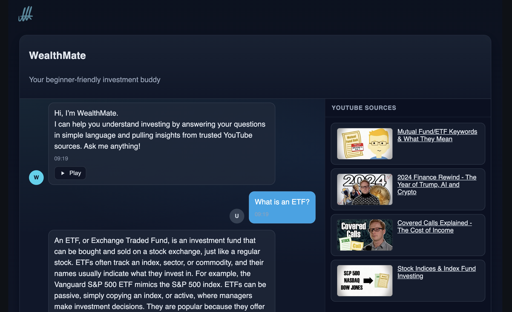

## YouTube RAG Service (WealthMate)



A Retrieval-Augmented Generation (RAG) assistant for investing education. It:
- Downloads captions from a popular YouTube channel: https://www.youtube.com/@ThePlainBagel/playlists 
- Embeds them into a local Chroma vector store.
- Exposes a `/you-tube-rag` endpoint that answers user questions grounded in those captions.
- Next.js frontend: https://maleckicoa.com/demo-apps/you-tube-rag.

### Tech stack
- **Python** 3.11–3.14 (managed with Poetry)
- **FastAPI** for the HTTP API
- **Chroma** for vector storage (`chroma_db/`)
- **OpenAI**:
  - Embeddings: `text-embedding-3-small`
  - Chat model: `gpt-4o-mini`
  - Audio TTS model `gpt-4o-mini-tts`
- **yt-dlp** for caption download
- **LangChain** for retrieval + orchestration

### Repository layout (service)
- `src/main.py`: FastAPI app exposing `POST /you-tube-rag` and a small CLI mode for local Q&A.
- `src/data_loader.py`: CLI to create caption data and embed into Chroma.
- `src/rag_runner.py`: RAG pipeline setup and the `chat()` function used by the API.
- `src/utils.py`: utilities for caption/text parsing and metadata extraction.
- `chroma_db/`: Chroma persist directory (created after embedding).
- `data/`: data_loader.py creates here: 1. JSON with Youtube video captions 2. JPG Thumbnails, one for each video

## Setup

### 1) Install dependencies

```bash
cd you-tube-rag
poetry install
```

### 2) Environment

Set your OpenAI key:

```bash
export OPENAI_API_KEY="sk-..."
```
The service will exit on startup if `OPENAI_API_KEY` is missing.

### 3) Prepare data (captions + embeddings)

The loader is provided a default Youtube channel and specific playlist "Investment Topics":
- `full`: https://www.youtube.com/playlist?list=PLD18sR-9Y-XFVCP-cSjCLr8A1B_IRsvp-

A short test playlist is also available, to test the tech stack and get the system running:
- `short`: https://www.youtube.com/playlist?list=PLD18sR-9Y-XH4WXRV9aSLKTU9a_eh6j6_

Create captions JSON and thumbnails (defaults to the `full` playlist if omitted):

```bash
poetry run python -m src.data_loader create            # uses default playlist
poetry run python -m src.data_loader create short      # or use the "short" preset
poetry run python -m src.data_loader create https://youtube.com/playlist?list=...
```

Embed captions into Chroma:

```bash
poetry run python -m src.data_loader embed
```

Do both steps in one go:

```bash
poetry run python -m src.data_loader all
```

Notes:
- Captions and thumbnails are written into `data/` and zipped to `data.zip`.
- Embeddings are stored in `chroma_db/` (persisted on disk).

## Run the API

Launch the FastAPI app with Uvicorn on port 8002 (the frontend expects this by default):

```bash
poetry run uvicorn src.main:app --host 0.0.0.0 --port 8002 --reload
```

### Endpoint

`POST /you-tube-rag`

Request body:
```json
{ "user_input": "What is dollar-cost averaging?" }
```

Response shape (example):
```json
{
  "result": {
    "answer": "Dollar-cost averaging is ...",
    "history": [
      {"type": "human", "content": "What is dollar-cost averaging?"},
      {"type": "ai", "content": "Dollar-cost averaging is ..."}
    ],
    "sources": [
      {"title": "Investing Basics - Lesson 1", "url": "https://youtu.be/...", "metadata": {...}, "excerpt": "..." }
    ]
  }
}
```

Example cURL:
```bash
curl -X POST http://localhost:8002/you-tube-rag \
  -H "Content-Type: application/json" \
  -d '{"user_input":"Explain index funds."}'
```

### RAG details
- Retriever: `k=10`
- Embedding model: `text-embedding-3-small`
- Chat model: `gpt-4.1` (temperature 0)
- Text chunking (loader): `chunk_size=800`, `chunk_overlap=150`
- The system prompt encourages answers strictly grounded in retrieved documents; if unknown, it replies that it does not know.
- A lightweight rewrite step attempts to reframe the question if prior turns suggest the user switched topics.

## Frontend integration
This project is a submodule of https://github.com/maleckicoa/investor-lab/ , which holds the Next.js frontend code.

The whole app is deployed at: https://maleckicoa.com/demo-apps/you-tube-rag


## Local CLI (optional)

You can also chat locally via the CLI loop:

```bash
poetry run python -m src.main
```

## Maintenance
- To refresh the vector store, re-run the loader `create` (or `all`) and `embed` steps.
- To reset everything: remove `data/` and `chroma_db/` and run the loader again.
- Keep `OPENAI_API_KEY` set when running the loader and the API.